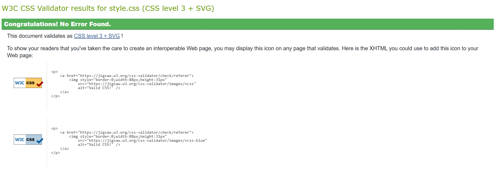
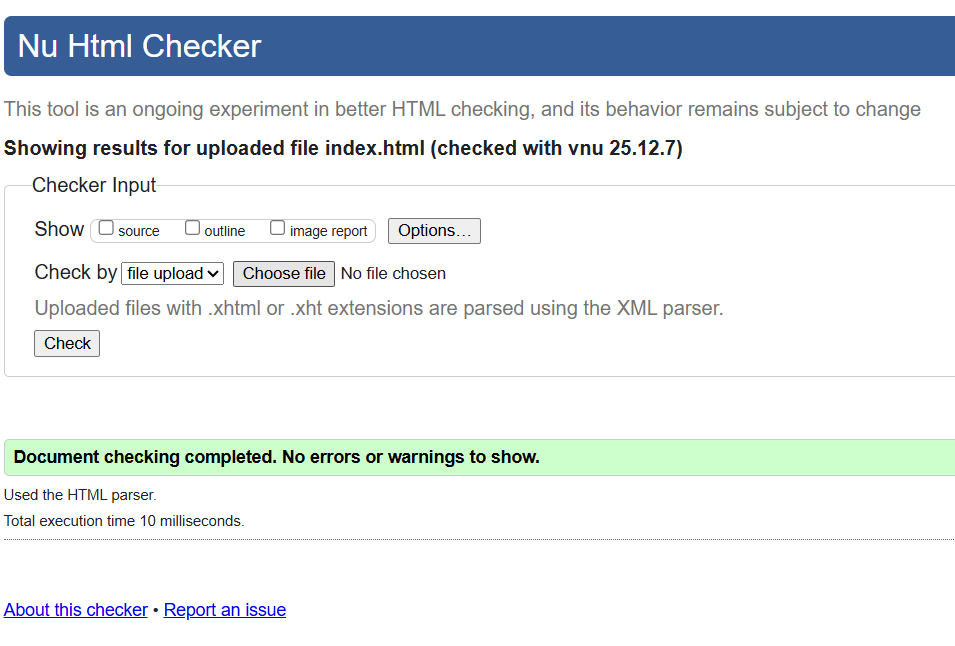
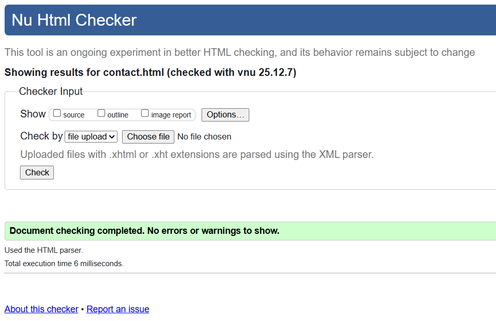
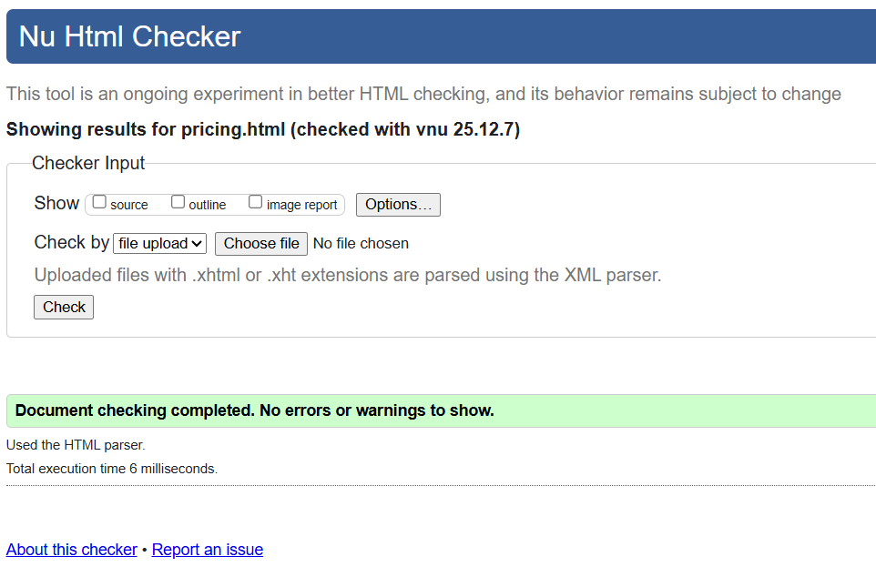

# Milestone 1 Project - Huxly.AI

## Section 1 Outline
From the Marking Scheme: "Design a Front end web
application based on the
principles of user experience
design, accessibility and
responsivity."

### 1.1 Navigation Menu
Each web page contains a nav element which contains a navbar built using the help of bootstrap.
The navbar is styled with one of boostraps' in-built styles, as a "primary nav" and I have added my own styling to shift the nav links to the right end of the nav bar. 
Each page is semantically structured, with the nav element nested in a header element, and the main content of the page nested in one or more section elements.
There is a secondary nav with external links nested in the footer element on each page.
In the pricing page there is also a section of the page which outlines the features of the products nested in an aside element.

### 1.2 Accessibility
Site is designed in a high contrast and adheres to accessibility guidelines. All non-text elements have an alt attribute attached (e.g. images) or an aria-label where appropriate. 
The colour scheme of the website broadly adheres to the theme "Ivory Glow" by Figma [Found here](https://www.figma.com/color-palettes/ivory-glow/ "Figma's Color Palette"). 

### 1.3 Informational Organisation
Information is structured in a user-friendly way - with semantic sections and each portion of information self contained in divs and styled in easily digestible ways. e.g. pricing is structured as an unorderd list in the html, but styled as separate "cards" which list key features and pricing for each subscription tier.
Headers are used across the site to convey structure and to signpost the user to the information they need.
Information is also structured in order of priority, with lower priority or loosely related information nested in an aside element (see pricing/features in 1.1 above).

### 1.4 Background/Foreground clarity
Backgrounds are limited to soft abstract images (generated by ChatGPT) using the Ivory Glow colour pallette as a propmt, or a solid neutral colour also from the Ivory Glow pallette. This ensures that foreground information is easy to read and isn't distracted by the backgrounds.

### 1.5 Consistent Graphics
All self-generated grpahics are consistent with the Ivory Glow colour scheme and any third party images (on the homepage) have been credited fully inside the html code. These third party images are neutral in colours and don't detract from the feel and look of the rest of the site - but are included as a practical illustration to convey meaning supplementary to the text information.

### 1.6 User Interactivity
The site contains no v ideo or audio but includes an embedded iframe of google maps on the contact page so that the user can find the location of the business. The site also contains a form which the user can interact with to contact the business.

## Section 2 Outline
From the marking scheme: "Develop and implement a static front-end web application using
HTML and CSS."

### 2.1 Website of at least 3 pages
The website has 3 pages - the index (home) page, the pricing page, and the contact page. 

### 2.2 CSS Validation
The CSS code which i have written in the style.css file passes through the Jigsaw CSS Validator with no errors.

### 2.3 HTML Validation
All html documents in the project passed html validation from validator.w3.org

index.html:

contact.html:

pricing.html:

### 2.4 Image Resolutions
All images across the site are either a fixed native resolution so that they don't scale up and appear distorted or pixelated - or the graphics for the backgrounds which scale with the viewport size are blujrred as a matter of stylistic intent and therefore do not appear distorted either.

### 2.5 External Links
All external links are coded with the the target="_blank" attribute in the anchor element. These are mostly featured in the footer nav across all pages.

### 2.6 Media Queries etc.
Media queries are utilised to make the site responsive to different viewport widths. 
The media queries mainly address the padding in the pricing page to ensure that the header navbar doesn't overlay page content such as headings. 
This is because the header navbar has a flex position of "fixed" so that it doesn't disappear when a user scrolls down the page. 
I have also utilised the col class in bootstrap for responsive design on div containers such as the pricing cards and the cards on the home page.
The background image and hero text are scaled responsively using "width: 100%;" and "font-size: 4vw;" in the stylesheet, which ensures images are always fit to the width of the viewport and the text stays a certain ratio to the view width in terms of size.

### 2.7 Semantic Markup
All content is semantially marked up as outlined earlier in the README. Navs are nested inside header and footer elements, and main content is nested inside section elements and aside elements where appropriate. 

### 2.8 Site-specific content.
All content is site specific with no Lorem ipsum or similar placeholder content. All the content on the site relates to the software being sold.

### 2.9 Clear Navigation. 
The navigation on the site is remarkably clear and user-friendly, with a navbar in the header which conveys to the user which page they're currely on, as wsell as a footer nav with other related links set out in a data table format, grouped together in categories (social media links, lega, contact links etc). Site navigation outside of these navbars is also intuitive at the bottom of site sections so that the user can navigate to related pages to the content (usually works as a CTA to funnel users to contact form).

## Section 3 Outline
From the marking scheme: "Maximise future maintainability through documentation, code structure and organisation."

### 3.1 README.md
You are reading it.

### 3.2 User Stories & Screenshots
#### User Stories
User Story 1:

As a Small Business Owner,
I want to access information on the features and price of the service,
So that I can make an informed purchase decision

Acceptance Criteria:
Pricing-page presents easily digestible information on pricing and features 

User Story 2:

As an Environmental NGO,
I want to contact the company,
So that I can explore potential collaborations.

Acceptance Criteria: 
Contact form is easily accessible and confirms submission, and opens in a separate tab.

User Story 3: 

As a sustainability manager,
I want to understand how Huxly.AI tracks my company's carbon emissions,
So that I can ascertain whether it would be valuable to my department.

Acceptance crtieria:
Homepage clearly outlines how the software works and the expected ROI.
